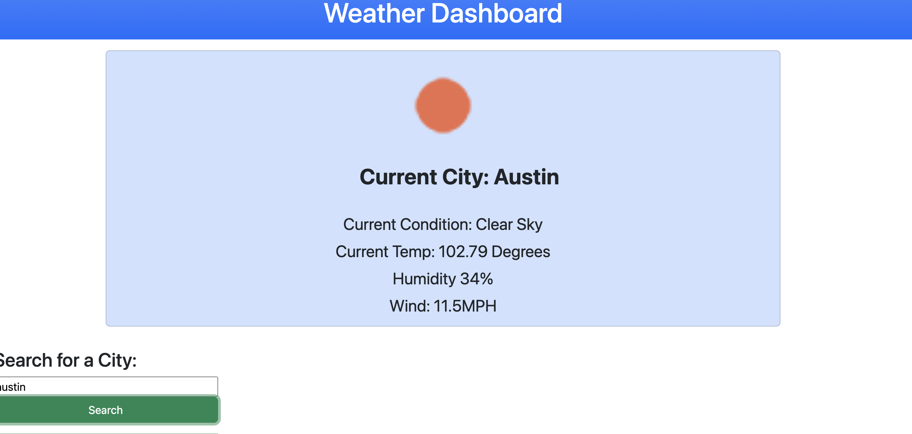

# Weather-API

## Description

I wanted to create an application that would test my skills using API's to fetch data and display it. This project allows a user to see the weather forecast for the current day in their desired city. I built this project ot expand my knowledge on web API's. I learned how to connect an web API through javascript.

## Installation

N/A

## Usage

To use this app type in the city of which you are in, or where you want to view the forecast and then press the search bar. 

## Credits

- https://openweathermap.org/forecast5
- https://www.w3schools.com/
- https://developer.mozilla.org/en-US/

## License

Please refer to the documentation in the Repo: https://mit-license.org/

## How to Contribute

The [Contributor Covenant](https://www.contributor-covenant.org/) is an industry standard

